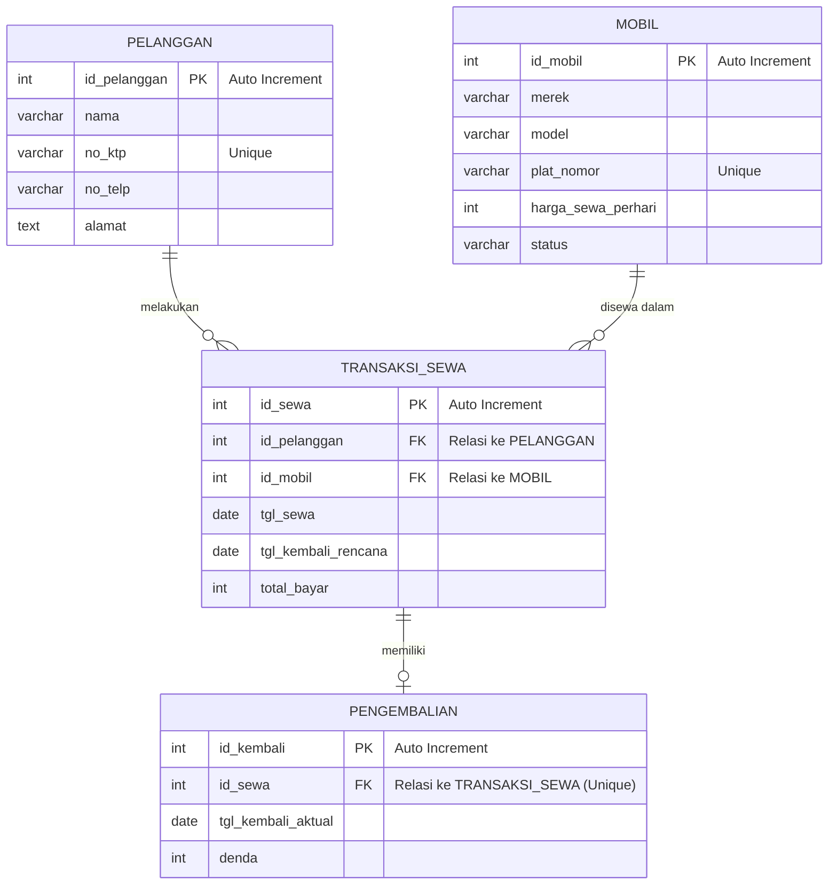

# UAS BASIS DATA - Sistem Informasi Rental Mobil

Repository ini berisi laporan jawaban UAS Basis Data mengenai rancangan database, dokumentasi ERD, normalisasi, script SQL DDL & DML, serta aplikasi CRUD berbasis Python dan PHP.

---

## 1. Topik yang Dipilih
**Topik: b. Sistem Informasi Rental Mobil**

Sistem ini dirancang untuk mengelola proses penyewaan mobil, dari pendaftaran pelanggan, pengelolaan ketersediaan armada mobil, pencatatan transaksi sewa, hingga proses pengembalian mobil beserta perhitungan dendanya.

---

## 2. Proses Bisnis dan Modul

### A. Modul Pelanggan (Keanggotaan)
- Pelanggan baru mendaftar dengan menyerahkan data pribadi (nama, nomor KTP, nomor telepon, dan alamat).
- Admin rental mencatat data pelanggan ke dalam sistem database.

### B. Modul Mobil (Armada)
- Admin mengelola armada mobil yang mencakup input data merek, model, plat nomor, tarif harga sewa per hari, dan status ketersediaan mobil.

### C. Modul Transaksi Sewa
- Pelanggan memilih mobil yang berstatus 'Tersedia'.
- Transaksi dicatat dengan tanggal mulai sewa dan rencana tanggal kembali. Total pembayaran dihitung sementara berdasarkan lama sewa dikali tarif per hari.
- Status mobil berubah menjadi 'Disewa' ketika transaksi sewa aktif.

### D. Modul Pengembalian & Denda
- Ketika mobil dikembalikan, tanggal pengembalian riil (aktual) dicatat.
- Jika terdapat keterlambatan atau kondisi khusus lainnya, admin akan menghitung dan mencatat nominal denda.
- Status ketersediaan mobil dikembalikan menjadi 'Tersedia'.

---

## 3. Pihak yang Terlibat (Aktor)

1. **Pelanggan (Customer)**:
   - Terlibat dalam modul Pelanggan, Transaksi Sewa, dan Pengembalian.
   - Peran: Memberikan data identitas diri, memilih mobil untuk disewa, melakukan pembayaran, serta mengembalikan mobil dan membayar denda (jika terlambat).
2. **Admin/Operator Rental**:
   - Terlibat di semua modul (Pelanggan, Mobil, Transaksi Sewa, Pengembalian).
   - Peran: Mengelola data master pelanggan dan mobil, mencatat transaksi sewa, mengonfirmasi pengembalian mobil, dan memproses pembayaran serta denda.

---

## 4. Entity Relationship Diagram (ERD)

Detail visualisasi ERD dapat dilihat pada file dokumentasi terpisah: **[erd.md](file:///home/akuma/projects/basdat/Sistem%20Informasi%20Rental%20Mobil/erd.md)**.

### Visualisasi ERD (Mermaid Diagram)



---

## 5. Kardinalitas Hubungan Antar Entitas

1. **Pelanggan ke Transaksi Sewa (`1 : N` / One-to-Many)**:
   - Satu pelanggan dapat melakukan banyak (N) kali transaksi sewa.
   - Satu transaksi sewa hanya dimiliki oleh satu pelanggan.
2. **Mobil ke Transaksi Sewa (`1 : N` / One-to-Many)**:
   - Satu mobil dapat disewakan dalam banyak (N) kali transaksi sewa yang berbeda secara berkala.
   - Satu transaksi sewa hanya melibatkan satu mobil.
3. **Transaksi Sewa ke Pengembalian (`1 : 1` / One-to-One)**:
   - Satu transaksi sewa memiliki maksimal satu catatan pengembalian (one-to-zero-or-one).
   - Catatan pengembalian hanya merujuk pada satu transaksi sewa.

---

## 6. Normalisasi Database

Analisis detail normalisasi dapat diakses di: **[normalisasi.md](file:///home/akuma/projects/basdat/Sistem%20Informasi%20Rental%20Mobil/normalisasi.md)**.

### Ringkasan Normalisasi:
- **1NF (First Normal Form)**: Menghilangkan repeating groups dan memastikan semua atribut bernilai atomik tunggal dalam satu tabel mentah (UNF/1NF).
- **2NF (Second Normal Form)**: Menghilangkan ketergantungan parsial dengan membagi tabel menjadi tabel master (**Pelanggan**, **Mobil**) dan tabel transaksi (**Transaksi_Sewa** dan **Pengembalian**).
- **3NF (Third Normal Form)**: Memastikan tidak ada ketergantungan transitif. Struktur tabel hasil dekomposisi di 2NF sudah secara otomatis memenuhi 3NF.

---

## 7. Implementasi Desain Database (DDL SQL)

Berikut adalah script DDL SQL untuk membuat database dan tabel-tabel di MySQL/MariaDB:

```sql
-- Membuat Database
CREATE DATABASE uas_rental_mobil;
USE uas_rental_mobil;

-- Tabel Pelanggan (Tabel Master 1)
CREATE TABLE pelanggan (
    id_pelanggan INT AUTO_INCREMENT PRIMARY KEY,
    nama VARCHAR(100) NOT NULL,
    no_ktp VARCHAR(16) NOT NULL UNIQUE,
    no_telp VARCHAR(15) NOT NULL,
    alamat TEXT NOT NULL
);

-- Tabel Mobil (Tabel Master 2)
CREATE TABLE mobil (
    id_mobil INT AUTO_INCREMENT PRIMARY KEY,
    merek VARCHAR(50) NOT NULL,
    model VARCHAR(50) NOT NULL,
    plat_nomor VARCHAR(15) NOT NULL UNIQUE,
    harga_sewa_perhari INT NOT NULL,
    status VARCHAR(20) DEFAULT 'Tersedia'
);

-- Tabel Transaksi Sewa (Tabel Transaksi Utama)
CREATE TABLE transaksi_sewa (
    id_sewa INT AUTO_INCREMENT PRIMARY KEY,
    id_pelanggan INT NOT NULL,
    id_mobil INT NOT NULL,
    tgl_sewa DATE NOT NULL,
    tgl_kembali_rencana DATE NOT NULL,
    total_bayar INT NOT NULL,
    FOREIGN KEY (id_pelanggan) REFERENCES pelanggan(id_pelanggan) ON DELETE CASCADE,
    FOREIGN KEY (id_mobil) REFERENCES mobil(id_mobil) ON DELETE CASCADE
);

-- Tabel Pengembalian (Tabel Transaksi Detail)
CREATE TABLE pengembalian (
    id_kembali INT AUTO_INCREMENT PRIMARY KEY,
    id_sewa INT NOT NULL UNIQUE,
    tgl_kembali_aktual DATE NOT NULL,
    denda INT DEFAULT 0,
    FOREIGN KEY (id_sewa) REFERENCES transaksi_sewa(id_sewa) ON DELETE CASCADE
);
```

---

## 8. Manipulasi Data Menggunakan SQL (DML)

### A. Pengisian Data (Insert)
```sql
-- Mengisi Data Master Pelanggan
INSERT INTO pelanggan (nama, no_ktp, no_telp, alamat) VALUES 
('Andi Wijaya', '3201112223330005', '0811223344', 'Jl. Sudirman No. 5'),
('Budi Santoso', '3201112223330006', '0812233445', 'Jl. Merdeka No. 12'),
('Citra Lestari', '3201112223330007', '0813344556', 'Jl. Thamrin No. 8');

-- Mengisi Data Master Mobil
INSERT INTO mobil (merek, model, plat_nomor, harga_sewa_perhari, status) VALUES 
('Suzuki', 'Ertiga', 'B 9999 OK', 300000, 'Tersedia'),
('Toyota', 'Avanza', 'B 1234 CD', 350000, 'Tersedia'),
('Honda', 'Brio', 'B 5678 EF', 250000, 'Tersedia');

-- Mengisi Data Transaksi Sewa
INSERT INTO transaksi_sewa (id_pelanggan, id_mobil, tgl_sewa, tgl_kembali_rencana, total_bayar) VALUES
(1, 1, '2026-06-01', '2026-06-03', 600000);
```

### B. Pembaruan Data (Update)
```sql
-- Memperbarui harga sewa mobil Suzuki Ertiga (ID: 1)
UPDATE mobil SET harga_sewa_perhari = 320000 WHERE id_mobil = 1;

-- Memperbarui alamat pelanggan Andi Wijaya (ID: 1)
UPDATE pelanggan SET alamat = 'Jl. Baru No. 99' WHERE id_pelanggan = 1;
```

### C. Penghapusan Data (Delete)
```sql
-- Menghapus pelanggan dengan ID 3
DELETE FROM pelanggan WHERE id_pelanggan = 3;
```

---

## 9. Aplikasi CRUD (Tabel Master Mobil)

Kami telah membuat implementasi program CRUD interaktif CLI dengan prepared statements untuk keamanan dari serangan SQL Injection.

### A. Menggunakan Python
Kode Python interaktif terletak di: **[crud_mobil.py](file:///home/akuma/projects/basdat/Sistem%20Informasi%20Rental%20Mobil/python/crud_mobil.py)**.
- **Konfigurasi**: Mengambil kredensial dari file `.env` di direktori Python.
- **Cara Menjalankan**:
  ```bash
  cd python
  # Mengaktifkan venv dan menginstal requirement jika belum
  pip install -r requirements.txt
  python crud_mobil.py
  ```

### B. Menggunakan PHP
Kode PHP interaktif terletak di: **[mobil.php](file:///home/akuma/projects/basdat/Sistem%20Informasi%20Rental%20Mobil/php/mobil.php)**.
- **Konfigurasi**: Mengambil kredensial dari file `.env` di direktori PHP.
- **Cara Menjalankan**:
  ```bash
  cd php
  php mobil.php
  ```
