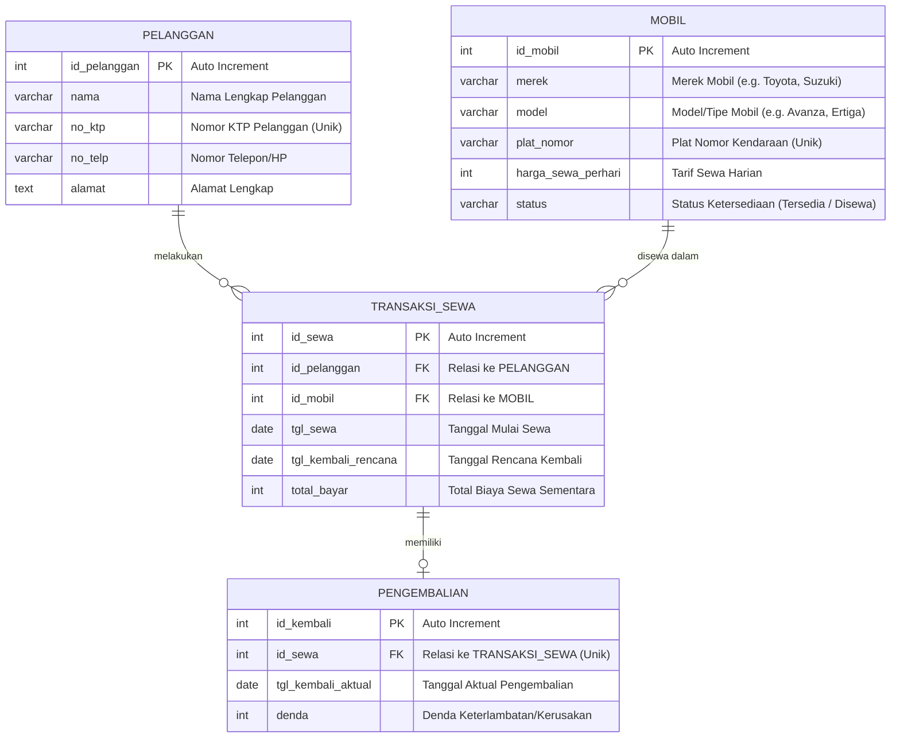

# UAS BASIS DATA - Sistem Informasi Rental Mobil

Repository ini berisi laporan jawaban UAS Basis Data mengenai rancangan database, dokumentasi ERD, normalisasi, script SQL DDL & DML, serta aplikasi CRUD berbasis Python dan PHP.

---

## 1. Topik yang Pilih
**Topik: b. Sistem Informasi Rental Mobil**

Sistem ini dirancang untuk mengelola proses penyewaan mobil, dari pendaftaran pelanggan, pengelolaan ketersediaan armada mobil, pencatatan transaksi sewa, hingga proses pengembalian mobil beserta perhitungan dendanya.

---

## 2. Proses Bisnis dan Modul

### A. Modul Pelanggan (Keanggotaan)
- Pelanggan baru mendaftar dengan menyerahkan data pribadi (nama, nomor KTP, nomor telepon, dan alamat).
- Admin rental mencatat data pelanggan ke dalam sistem database.

### B. Modul Mobil (Armada)
- Admin mengelola armada mobil yang mencakup input data merek, model, plat nomor, tarif harga sewa per hari, dan status ketersediaan mobil.

### C. Modul Transaksi Sewa
- Pelanggan memilih mobil yang berstatus 'Tersedia'.
- Transaksi dicatat dengan tanggal mulai sewa dan rencana tanggal kembali. Total pembayaran dihitung sementara berdasarkan lama sewa dikali tarif per hari.
- Status mobil berubah menjadi 'Disewa' ketika transaksi sewa aktif.

### D. Modul Pengembalian & Denda
- Ketika mobil dikembalikan, tanggal pengembalian riil (aktual) dicatat.
- Jika terdapat keterlambatan atau kondisi khusus lainnya, admin akan menghitung dan mencatat nominal denda.
- Status ketersediaan mobil dikembalikan menjadi 'Tersedia'.

---

## 3. Pihak yang Terlibat (Aktor)

1. **Pelanggan (Customer)**:
   - Terlibat dalam modul Pelanggan, Transaksi Sewa, dan Pengembalian.
   - Peran: Memberikan data identitas diri, memilih mobil untuk disewa, melakukan pembayaran, serta mengembalikan mobil dan membayar denda (jika terlambat).
2. **Admin/Operator Rental**:
   - Terlibat di semua modul (Pelanggan, Mobil, Transaksi Sewa, Pengembalian).
   - Peran: Mengelola data master pelanggan dan mobil, mencatat transaksi sewa, mengonfirmasi pengembalian mobil, dan memproses pembayaran serta denda.

---

## 4. Entity Relationship Diagram (ERD)

### Visualisasi ERD (Mermaid Diagram)



### Deskripsi Entitas & Atribut
- **Pelanggan**: Menyimpan data identitas pelanggan yang menyewa mobil.
  - `id_pelanggan` (PK): Identifikasi unik untuk setiap pelanggan (Auto Increment).
  - `nama`: Nama lengkap pelanggan.
  - `no_ktp`: Nomor KTP pelanggan untuk validasi identitas (Unique).
  - `no_telp`: Nomor telepon pelanggan yang dapat dihubungi.
  - `alamat`: Alamat tempat tinggal pelanggan.
- **Mobil**: Menyimpan data armada mobil yang tersedia untuk disewakan.
  - `id_mobil` (PK): Identifikasi unik untuk setiap mobil (Auto Increment).
  - `merek`: Merek pabrikan mobil (misal: Toyota, Suzuki, Honda).
  - `model`: Model spesifik mobil (misal: Avanza, Ertiga, Jazz).
  - `plat_nomor`: Nomor plat polisi kendaraan (Unique).
  - `harga_sewa_perhari`: Tarif harga sewa per 24 jam.
  - `status`: Status ketersediaan mobil (misalnya: 'Tersedia', 'Disewa').
- **Transaksi Sewa**: Mencatat transaksi penyewaan mobil oleh pelanggan.
  - `id_sewa` (PK): Identifikasi unik untuk setiap transaksi sewa (Auto Increment).
  - `id_pelanggan` (FK): Menghubungkan transaksi dengan pelanggan yang menyewa.
  - `id_mobil` (FK): Menghubungkan transaksi dengan mobil yang disewa.
  - `tgl_sewa`: Tanggal pengambilan mobil/mulai sewa.
  - `tgl_kembali_rencana`: Tanggal jatuh tempo pengembalian yang direncanakan.
  - `total_bayar`: Total biaya sewa (dihitung dari lama sewa dikali harga sewa per hari).
- **Pengembalian**: Mencatat data pengembalian mobil dan penyelesaian transaksi sewa.
  - `id_kembali` (PK): Identifikasi unik untuk catatan pengembalian (Auto Increment).
  - `id_sewa` (FK): Menghubungkan data pengembalian dengan transaksi sewa yang sesuai (Unique).
  - `tgl_kembali_aktual`: Tanggal ketika mobil benar-benar dikembalikan.
  - `denda`: Biaya tambahan jika mobil dikembalikan lewat dari rencana atau mengalami kerusakan.

---

## 5. Kardinalitas Hubungan Antar Entitas

1. **Pelanggan ke Transaksi Sewa (`1 : N` / One-to-Many)**:
   - **Kardinalitas**: `1 Pelanggan dapat melakukan banyak (N) Transaksi Sewa`.
   - **Penjelasan**: Seorang pelanggan terdaftar dapat melakukan sewa berkali-kali pada waktu yang berbeda. Namun, setiap satu transaksi sewa hanya dapat dilakukan oleh satu pelanggan yang terdaftar.
2. **Mobil ke Transaksi Sewa (`1 : N` / One-to-Many)**:
   - **Kardinalitas**: `1 Mobil dapat disewakan dalam banyak (N) Transaksi Sewa`.
   - **Penjelasan**: Satu unit mobil dapat disewa berulang kali dalam transaksi yang berbeda seiring waktu. Setiap satu transaksi sewa hanya mencantumkan satu unit mobil yang disewa.
3. **Transaksi Sewa ke Pengembalian (`1 : 1` / One-to-One atau One-to-Zero-or-One)**:
   - **Kardinalitas**: `1 Transaksi Sewa memiliki maksimal 1 Pengembalian`.
   - **Penjelasan**: Sebuah transaksi rental mobil yang aktif awalnya belum memiliki data pengembalian. Ketika mobil dikembalikan, transaksi tersebut akan memiliki tepat satu data pengembalian. Satu data pengembalian tidak dapat merujuk ke lebih dari satu transaksi sewa.

---

## 6. Normalisasi Database

Proses normalisasi digunakan untuk meminimalkan redundansi data dan menghindari anomali (insert, update, delete) pada database. Berikut adalah tahapan normalisasi dari data tidak ternormalisasi hingga memenuhi bentuk 3NF (Third Normal Form).

### A. Bentuk Tidak Ternormalisasi (Unnormalized Form - UNF) & 1NF (First Normal Form)
Pada tahap **1NF**, kita memastikan bahwa setiap kolom berisi nilai atomik (tunggal) dan tidak ada grup berulang (repeating groups).

**Atribut Unnormalized / 1NF**:
Dalam satu baris data sewa, terdapat informasi pelanggan, mobil, transaksi, dan pengembalian yang digabungkan menjadi satu tabel besar:

| Nama Kolom | Jenis Kunci | Keterangan |
| :--- | :--- | :--- |
| **id_sewa** | Primary Key (PK) | ID unik untuk transaksi sewa |
| **id_pelanggan** | - | ID Pelanggan |
| **nama_pelanggan** | - | Nama lengkap pelanggan |
| **no_ktp** | - | Nomor KTP pelanggan |
| **id_mobil** | - | ID Mobil |
| **merek_mobil** | - | Merek mobil |
| **plat_nomor** | - | Plat nomor kendaraan |
| **harga_sewa_perhari** | - | Harga sewa mobil per hari |
| **tgl_sewa** | - | Tanggal sewa mobil |
| **tgl_kembali_rencana** | - | Tanggal rencana kembali |
| **total_bayar** | - | Total biaya sewa |
| **tgl_kembali_aktual** | - | Tanggal aktual pengembalian |
| **denda** | - | Denda keterlambatan jika ada |

> **Kelemahan 1NF**: Redundansi data yang sangat tinggi. Misalnya, jika seorang pelanggan menyewa mobil beberapa kali, maka data diri pelanggan (nama, nomor KTP, nomor telepon, alamat) harus ditulis ulang di setiap baris transaksi sewa. Begitu pula dengan spesifikasi mobil.

### B. Bentuk Normal Kedua (2NF - Second Normal Form)
Untuk memenuhi **2NF**, database harus sudah memenuhi **1NF** dan **semua atribut non-key harus bergantung sepenuhnya (fully functionally dependent) pada Primary Key**. Atribut yang hanya bergantung pada sebagian key (partial dependency) dipisahkan menjadi tabel tersendiri.

Berdasarkan Ketergantungan Fungsional (Functional Dependency):

#### 1. Tabel Pelanggan (Master)
Menyimpan data identitas unik untuk setiap pelanggan.

| Nama Kolom | Jenis Kunci | Keterangan |
| :--- | :--- | :--- |
| **id_pelanggan** | Primary Key (PK) | Auto Increment, ID Pelanggan |
| **nama** | - | Nama lengkap pelanggan |
| **no_ktp** | Unique | Nomor KTP pelanggan (Unik) |
| **no_telp** | - | Nomor telepon/HP pelanggan |
| **alamat** | - | Alamat tempat tinggal |

#### 2. Tabel Mobil (Master)
Menyimpan data armada mobil yang tersedia untuk disewa.

| Nama Kolom | Jenis Kunci | Keterangan |
| :--- | :--- | :--- |
| **id_mobil** | Primary Key (PK) | Auto Increment, ID Mobil |
| **merek** | - | Merek pabrikan mobil |
| **model** | - | Model/tipe mobil |
| **plat_nomor** | Unique | Nomor plat polisi (Unik) |
| **harga_sewa_perhari** | - | Tarif sewa per hari |
| **status** | - | Status mobil ('Tersedia' / 'Disewa') |

#### 3. Tabel Transaksi_Sewa (Transaksi Utama)
Menghubungkan pelanggan dan mobil dalam transaksi penyewaan.

| Nama Kolom | Jenis Kunci | Keterangan |
| :--- | :--- | :--- |
| **id_sewa** | Primary Key (PK) | Auto Increment, ID Sewa |
| **id_pelanggan** | Foreign Key (FK) | Relasi ke Tabel Pelanggan |
| **id_mobil** | Foreign Key (FK) | Relasi ke Tabel Mobil |
| **tgl_sewa** | - | Tanggal mulai sewa |
| **tgl_kembali_rencana** | - | Tanggal rencana pengembalian |
| **total_bayar** | - | Total biaya sewa sementara |

#### 4. Tabel Pengembalian (Transaksi Detail)
Mencatat data penyelesaian transaksi sewa ketika mobil dikembalikan.

| Nama Kolom | Jenis Kunci | Keterangan |
| :--- | :--- | :--- |
| **id_kembali** | Primary Key (PK) | Auto Increment, ID Pengembalian |
| **id_sewa** | Foreign Key (FK), Unique | Relasi ke Tabel Transaksi_Sewa |
| **tgl_kembali_aktual** | - | Tanggal mobil dikembalikan secara riil |
| **denda** | - | Biaya denda jika terlambat / rusak |

### C. Bentuk Normal Ketiga (3NF - Third Normal Form)
Untuk memenuhi **3NF**, database harus sudah memenuhi **2NF** dan **tidak boleh ada ketergantungan transitif** (transitive dependency), yaitu atribut non-primary key tidak boleh menentukan atribut non-primary key lainnya.

Mari kita periksa struktur tabel hasil 2NF:
1. **Tabel Pelanggan**: Atribut `nama`, `no_ktp`, `no_telp`, `alamat` semuanya bergantung langsung pada `id_pelanggan`. Tidak ada atribut non-key yang menentukan atribut non-key lainnya. (Memenuhi 3NF)
2. **Tabel Mobil**: Atribut `merek`, `model`, `plat_nomor`, `harga_sewa_perhari`, `status` semuanya bergantung langsung pada `id_mobil`. Tidak ada ketergantungan transitif. (Memenuhi 3NF)
3. **Tabel Transaksi_Sewa**: Atribut `tgl_sewa`, `tgl_kembali_rencana`, dan `total_bayar` bergantung langsung pada `id_sewa`. Meskipun `total_bayar` dapat dihitung secara logis dari `selisih hari * harga_sewa_perhari`, penyimpanan nilai riil di database diperlukan untuk mengamankan data historis (jika di kemudian hari tarif sewa mobil diubah, total bayar transaksi masa lalu tidak ikut berubah). Tidak ada ketergantungan transitif. (Memenuhi 3NF)
4. **Tabel Pengembalian**: Atribut `tgl_kembali_aktual` dan `denda` bergantung langsung pada `id_kembali` (dan melalui `id_sewa`). Tidak ada ketergantungan transitif antar atribut non-key. (Memenuhi 3NF)

**Kesimpulan**: Struktur tabel hasil dekomposisi pada tahap **2NF** di atas secara otomatis telah memenuhi kriteria **3NF** karena tidak mengandung ketergantungan transitif tersembunyi.

---

## 7. Implementasi Desain Database (DDL SQL)

Berikut adalah script DDL SQL untuk membuat database dan tabel-tabel di MySQL/MariaDB:

```sql
-- Membuat Database
CREATE DATABASE uas_rental_mobil;
USE uas_rental_mobil;

-- Tabel Pelanggan (Tabel Master 1)
CREATE TABLE pelanggan (
    id_pelanggan INT AUTO_INCREMENT PRIMARY KEY,
    nama VARCHAR(100) NOT NULL,
    no_ktp VARCHAR(16) NOT NULL UNIQUE,
    no_telp VARCHAR(15) NOT NULL,
    alamat TEXT NOT NULL
);

-- Tabel Mobil (Tabel Master 2)
CREATE TABLE mobil (
    id_mobil INT AUTO_INCREMENT PRIMARY KEY,
    merek VARCHAR(50) NOT NULL,
    model VARCHAR(50) NOT NULL,
    plat_nomor VARCHAR(15) NOT NULL UNIQUE,
    harga_sewa_perhari INT NOT NULL,
    status VARCHAR(20) DEFAULT 'Tersedia'
);

-- Tabel Transaksi Sewa (Tabel Transaksi Utama)
CREATE TABLE transaksi_sewa (
    id_sewa INT AUTO_INCREMENT PRIMARY KEY,
    id_pelanggan INT NOT NULL,
    id_mobil INT NOT NULL,
    tgl_sewa DATE NOT NULL,
    tgl_kembali_rencana DATE NOT NULL,
    total_bayar INT NOT NULL,
    FOREIGN KEY (id_pelanggan) REFERENCES pelanggan(id_pelanggan) ON DELETE CASCADE,
    FOREIGN KEY (id_mobil) REFERENCES mobil(id_mobil) ON DELETE CASCADE
);

-- Tabel Pengembalian (Tabel Transaksi Detail)
CREATE TABLE pengembalian (
    id_kembali INT AUTO_INCREMENT PRIMARY KEY,
    id_sewa INT NOT NULL UNIQUE,
    tgl_kembali_aktual DATE NOT NULL,
    denda INT DEFAULT 0,
    FOREIGN KEY (id_sewa) REFERENCES transaksi_sewa(id_sewa) ON DELETE CASCADE
);
```

---

## 8. Manipulasi Data Menggunakan SQL (DML)

### A. Pengisian Data (Insert)
```sql
-- Mengisi Data Master Pelanggan
INSERT INTO pelanggan (nama, no_ktp, no_telp, alamat) VALUES 
('Andi Wijaya', '3201112223330005', '0811223344', 'Jl. Sudirman No. 5'),
('Budi Santoso', '3201112223330006', '0812233445', 'Jl. Merdeka No. 12'),
('Citra Lestari', '3201112223330007', '0813344556', 'Jl. Thamrin No. 8');

-- Mengisi Data Master Mobil
INSERT INTO mobil (merek, model, plat_nomor, harga_sewa_perhari, status) VALUES 
('Suzuki', 'Ertiga', 'B 9999 OK', 300000, 'Tersedia'),
('Toyota', 'Avanza', 'B 1234 CD', 350000, 'Tersedia'),
('Honda', 'Brio', 'B 5678 EF', 250000, 'Tersedia');

-- Mengisi Data Transaksi Sewa
INSERT INTO transaksi_sewa (id_pelanggan, id_mobil, tgl_sewa, tgl_kembali_rencana, total_bayar) VALUES
(1, 1, '2026-06-01', '2026-06-03', 600000);
```

### B. Pembaruan Data (Update)
```sql
-- Memperbarui harga sewa mobil Suzuki Ertiga (ID: 1)
UPDATE mobil SET harga_sewa_perhari = 320000 WHERE id_mobil = 1;

-- Memperbarui alamat pelanggan Andi Wijaya (ID: 1)
UPDATE pelanggan SET alamat = 'Jl. Baru No. 99' WHERE id_pelanggan = 1;
```

### C. Penghapusan Data (Delete)
```sql
-- Menghapus pelanggan dengan ID 3
DELETE FROM pelanggan WHERE id_pelanggan = 3;
```

---

## 9. Aplikasi CRUD (2 Tabel Master: Mobil & Pelanggan)

Kami telah membuat implementasi program CRUD interaktif untuk mengelola data master mobil dan pelanggan secara aman dari serangan SQL Injection.

### A. Menggunakan Python
Kode Python interaktif terletak di: **[crud_mobil.py](file:///home/akuma/projects/basdat/Sistem%20Informasi%20Rental%20Mobil/python/crud_mobil.py)**.
- **Konfigurasi**: Mengambil kredensial dari file `.env` di direktori Python.
- **Cara Menjalankan**:
  ```bash
  cd python
  # Mengaktifkan venv dan menginstal requirement jika belum
  pip install -r requirements.txt
  python crud_mobil.py
  ```

### B. Menggunakan PHP (Web MVC App)
Aplikasi PHP dirancang menggunakan arsitektur **MVC (Model-View-Controller) Sederhana** berbasis web yang aman dan modern (menggunakan *glassmorphic dark design*).

**Struktur Folder MVC**:
- **Front Controller**: [index.php](file:///home/akuma/projects/basdat/Sistem%20Informasi%20Rental%20Mobil/php/index.php) (Router utama)
- **Database Config**: [config.php](file:///home/akuma/projects/basdat/Sistem%20Informasi%20Rental%20Mobil/php/config.php) (Mengelola koneksi database secara aman)
- **Model**: [Mobil.php](file:///home/akuma/projects/basdat/Sistem%20Informasi%20Rental%20Mobil/php/models/Mobil.php) (Logika query database terproteksi SQLi)
- **Controller**: [MobilController.php](file:///home/akuma/projects/basdat/Sistem%20Informasi%20Rental%20Mobil/php/controllers/MobilController.php) (Pemrosesan aksi/permintaan)
- **View**: [mobil_view.php](file:///home/akuma/projects/basdat/Sistem%20Informasi%20Rental%20Mobil/php/views/mobil_view.php) (User Interface Web responsif & modern)

- **Konfigurasi**: Mengambil kredensial dari file `.env` di direktori PHP.
- **Cara Menjalankan**:
  1. Jalankan PHP Built-in Web Server di terminal:
     ```bash
     cd php
     php -S localhost:8080
     ```
  2. Buka browser dan akses alamat `http://localhost:8080` atau `http://localhost:8080/mobil.php`.
