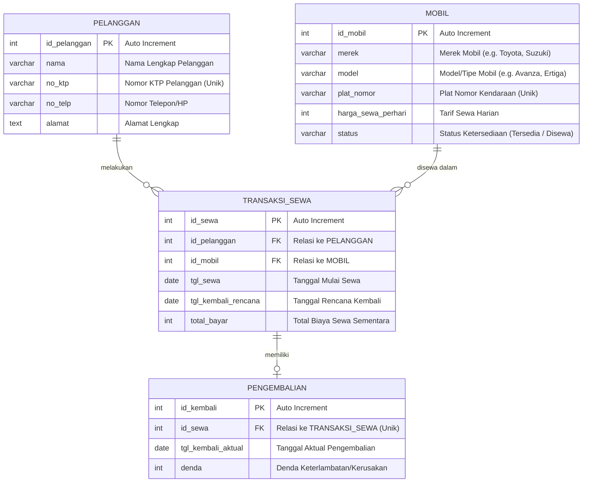

# Entity Relationship Diagram (ERD) & Kardinalitas

Dokumen ini menjelaskan rancangan Entity Relationship Diagram (ERD) dan hubungan kardinalitas untuk Sistem Informasi Rental Mobil.

---

## 1. Diagram ERD (Mermaid)

Berikut adalah visualisasi ERD menggunakan diagram Mermaid:

---

## 2. Deskripsi Entitas & Atribut

### A. Pelanggan
Menyimpan data identitas pelanggan yang menyewa mobil.
- **id_pelanggan (PK)**: Identifikasi unik untuk setiap pelanggan (Auto Increment).
- **nama**: Nama lengkap pelanggan.
- **no_ktp**: Nomor KTP pelanggan untuk validasi identitas (Unique).
- **no_telp**: Nomor telepon pelanggan yang dapat dihubungi.
- **alamat**: Alamat tempat tinggal pelanggan.

### B. Mobil
Menyimpan data armada mobil yang tersedia untuk disewakan.
- **id_mobil (PK)**: Identifikasi unik untuk setiap mobil (Auto Increment).
- **merek**: Merek pabrikan mobil (misal: Toyota, Suzuki, Honda).
- **model**: Model spesifik mobil (misal: Avanza, Ertiga, Jazz).
- **plat_nomor**: Nomor plat polisi kendaraan (Unique).
- **harga_sewa_perhari**: Tarif harga sewa per 24 jam.
- **status**: Status ketersediaan mobil (misalnya: 'Tersedia', 'Disewa').

### C. Transaksi Sewa
Mencatat transaksi penyewaan mobil oleh pelanggan.
- **id_sewa (PK)**: Identifikasi unik untuk setiap transaksi sewa (Auto Increment).
- **id_pelanggan (FK)**: Menghubungkan transaksi dengan pelanggan yang menyewa.
- **id_mobil (FK)**: Menghubungkan transaksi dengan mobil yang disewa.
- **tgl_sewa**: Tanggal pengambilan mobil/mulai sewa.
- **tgl_kembali_rencana**: Tanggal jatuh tempo pengembalian yang direncanakan.
- **total_bayar**: Total biaya sewa (dihitung dari lama sewa dikali harga sewa per hari).

### D. Pengembalian
Mencatat data pengembalian mobil dan penyelesaian transaksi sewa.
- **id_kembali (PK)**: Identifikasi unik untuk catatan pengembalian (Auto Increment).
- **id_sewa (FK)**: Menghubungkan data pengembalian dengan transaksi sewa yang sesuai (Unique).
- **tgl_kembali_aktual**: Tanggal ketika mobil benar-benar dikembalikan.
- **denda**: Biaya tambahan jika mobil dikembalikan lewat dari rencana atau mengalami kerusakan.

---

## 3. Hubungan Kardinalitas

### A. Pelanggan ke Transaksi Sewa (`1 : N` / One-to-Many)
- **Kardinalitas**: `1 Pelanggan dapat melakukan banyak (N) Transaksi Sewa`.
- **Penjelasan**: Seorang pelanggan terdaftar dapat melakukan sewa berkali-kali pada waktu yang berbeda. Namun, setiap satu transaksi sewa hanya dapat dilakukan oleh satu pelanggan yang terdaftar.

### B. Mobil ke Transaksi Sewa (`1 : N` / One-to-Many)
- **Kardinalitas**: `1 Mobil dapat disewakan dalam banyak (N) Transaksi Sewa`.
- **Penjelasan**: Satu unit mobil dapat disewa berulang kali dalam transaksi yang berbeda seiring waktu. Setiap satu transaksi sewa hanya mencantumkan satu unit mobil yang disewa.

### C. Transaksi Sewa ke Pengembalian (`1 : 1` / One-to-One atau One-to-Zero-or-One)
- **Kardinalitas**: `1 Transaksi Sewa memiliki maksimal 1 Pengembalian`.
- **Penjelasan**: Sebuah transaksi rental mobil yang aktif awalnya belum memiliki data pengembalian. Ketika mobil dikembalikan, transaksi tersebut akan memiliki tepat satu data pengembalian. Satu data pengembalian tidak dapat merujuk ke lebih dari satu transaksi sewa.
